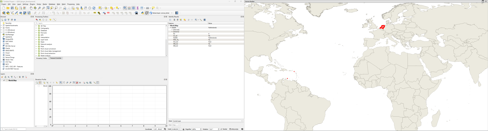

# Canvas Docker QGIS Plugin

Canvas Docker is a QGIS plugin that allows you to undock the map canvas from the main window, move it to another screen, and maximize it for enhanced workspace flexibility. The plugin frees up space in the main QGIS window for other dockable panels and tools.

## Features
- Toggle button to undock/dock the map canvas
- Floating, draggable, and maximizable canvas window
- Canvas remains fully interactive and functional
- Redocking restores the canvas to its original position

## Installation
1. Download or clone this repository:
   ```
   git clone https://github.com/emielverstegen/canvas_docker.git
   ```
2. Copy the `canvas_docker` folder to your QGIS plugins directory:
   - Windows: `C:\Users\<username>\AppData\Roaming\QGIS\QGIS3\profiles\<profile>\python\plugins\`
   - Linux: `~/.local/share/QGIS/QGIS3/profiles/<profile>/python/plugins/`
3. Start QGIS and enable the plugin via the Plugin Manager.

## Usage
- Click the Canvas Docker button in the QGIS toolbar to undock the map canvas.
- Use the maximize button in the floating window to fill the current screen.
- Use the close button or toggle the toolbar button to redock the canvas.
- The freed space in the main window can be used for other dockable panels.

## Screenshots


## Development
- Qt6 and PyQt6 compatible
- Designed for QGIS 3.x and above
- Contributions and suggestions welcome!

## Contributing
1. Fork the repository
2. Create a feature branch
3. Submit a pull request

## License
This plugin is licensed under the GNU General Public License v2 or later.

## Author
Emiel Verstegen

---
For questions or feedback, please open an issue on GitHub.
